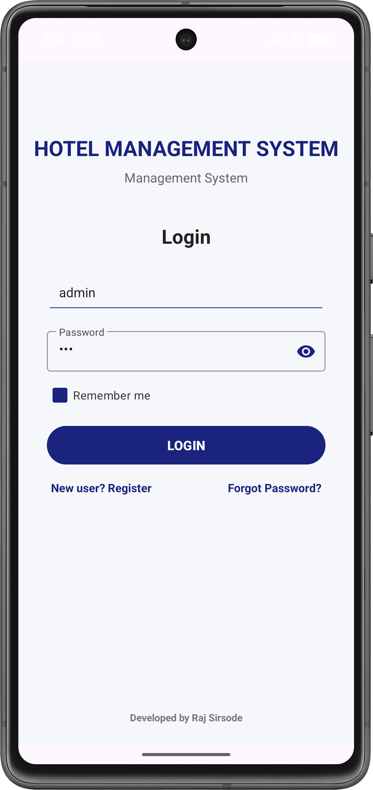
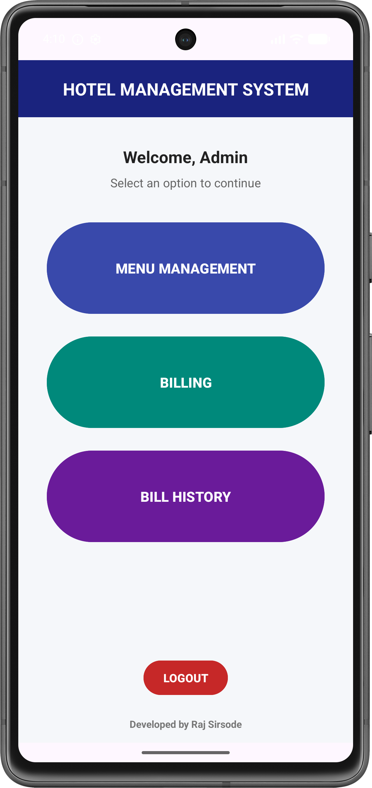
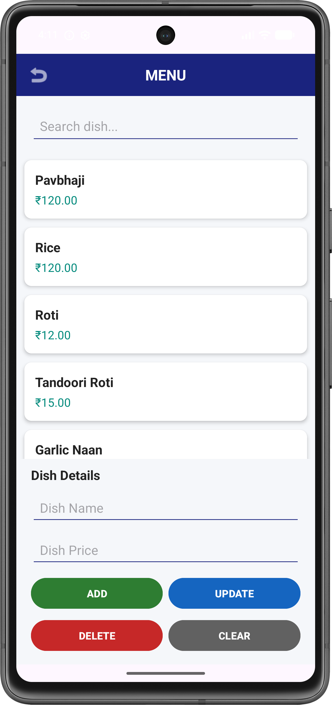
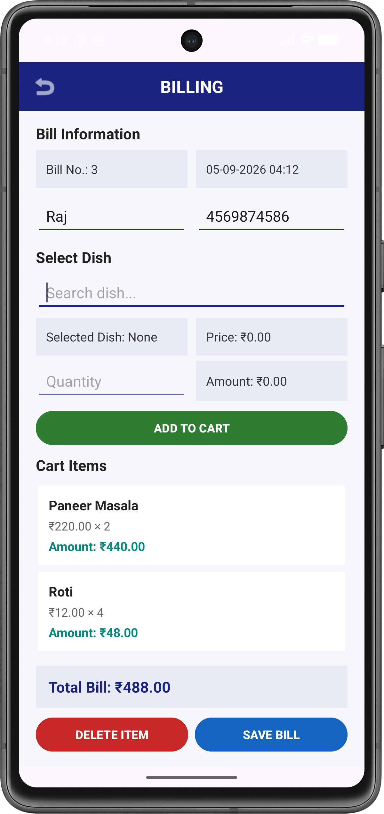
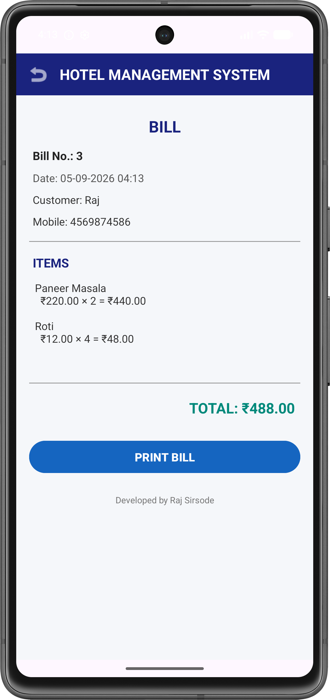
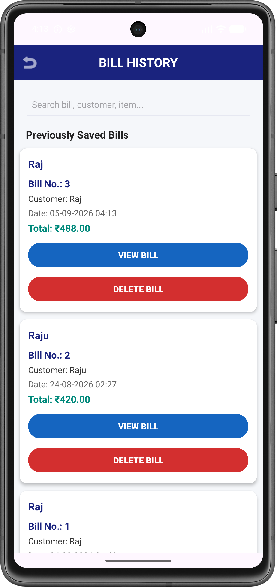
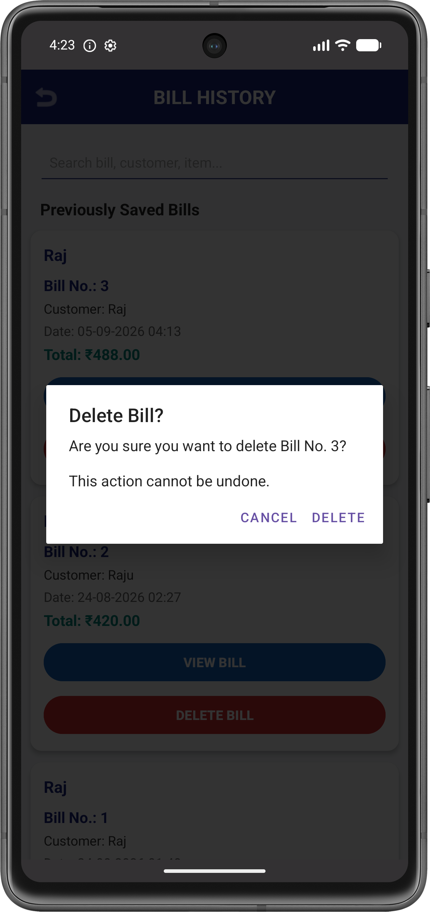
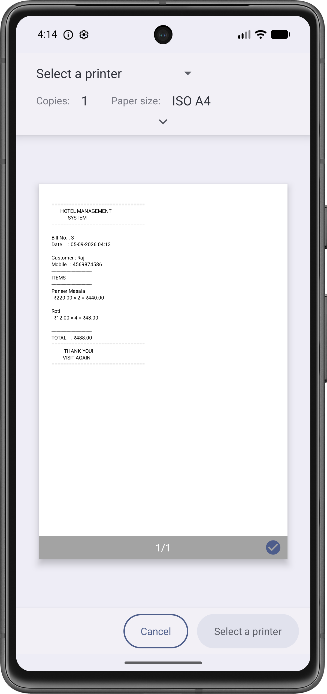

# 🏨 Hotel Management System – Android App

An Android-based **Hotel Management System** developed using **Java and Android Studio**.

The application provides a simple and user-friendly solution for managing hotel/restaurant menu items, billing, customers, and saved bills using a **local SQLite database**.

---

## 📱 Project Overview

The Hotel Management System is designed to digitize basic hotel management operations.

Instead of maintaining menu and billing information manually, the application allows the administrator to manage dishes, create bills, save bills, view previous bills, delete unwanted bills, and print bills using the Android printing system.

The application uses **SQLite** for local data storage, making it possible to use the system without requiring a remote database server.

---

## ✨ Features

### 🔐 Login System
- Admin login
- Local SQLite-based authentication
- Default administrator account
- Simple and secure login interface

### 🍽️ Menu Management
- Add new dishes
- View available dishes
- Search dishes
- Update dish information
- Delete dishes
- Store dish name and price locally

### 🧾 Billing System
- Enter customer details
- Select dishes
- Add dishes to cart
- Set quantity
- Automatically calculate item amount
- Calculate total bill
- Save bills locally
- Generate unique bill numbers

### 📋 Bill History
- View previously saved bills
- Display:
  - Bill number
  - Customer name
  - Date
  - Total amount
- Open complete bill details

### 🗑️ Delete Bill
- Delete unwanted bills
- Confirmation dialog before deletion
- Deletes both bill information and related bill items
- Prevents accidental deletion

### 🖨️ Print Bill
- Generate a printable bill
- Android Print Framework integration
- Print preview through Android's printing system
- Allows selection of an available printer/print service
- Suitable for compatible Wi-Fi printers

---

## 🛠️ Technology Stack

| Technology | Purpose |
|---|---|
| Java | Application development |
| Android Studio | Development environment |
| XML | User interface design |
| SQLite | Local database |
| Android SDK | Android application development |
| RecyclerView | Displaying lists |
| Android Print Framework | Bill printing |
| Gradle | Build and dependency management |

---

## 🗂️ Project Structure

```text
Hotel-Management-System/
│
├── app/
│   ├── src/
│   │   └── main/
│   │       ├── java/
│   │       │   └── com.example.hotelmanagementsystem/
│   │       │       │
│   │       │       ├── LoginActivity.java
│   │       │       ├── DashboardActivity.java
│   │       │       ├── MenuActivity.java
│   │       │       ├── BillingActivity.java
│   │       │       ├── BillHistoryActivity.java
│   │       │       ├── BillDetailsActivity.java
│   │       │       ├── BillPrintAdapter.java
│   │       │       ├── DatabaseHelper.java
│   │       │       ├── Bill.java
│   │       │       ├── BillAdapter.java
│   │       │       ├── Dish.java
│   │       │       ├── DishAdapter.java
│   │       │       ├── CartItem.java
│   │       │       └── CartAdapter.java
│   │       │
│   │       ├── res/
│   │       │   ├── layout/
│   │       │   ├── drawable/
│   │       │   ├── mipmap/
│   │       │   └── values/
│   │       │
│   │       └── AndroidManifest.xml
│   │
│   └── build.gradle.kts
│
├── gradle/
├── build.gradle.kts
├── settings.gradle.kts
└── README.md
````

---

## 🗄️ Database Structure

The application uses a local **SQLite database**.

### Users Table

Stores administrator login information.

```text
users
│
├── id
├── username
├── email
└── password
```

### Dishes Table

Stores menu/dish information.

```text
dishes
│
├── dish_id
├── dish_name
└── price
```

### Bills Table

Stores the main information about each bill.

```text
bills
│
├── bill_no
├── bill_date
├── customer_name
├── mobile_no
└── total_bill
```

### Bill Details Table

Stores individual items belonging to each bill.

```text
bill_details
│
├── id
├── bill_no
├── dish_name
├── price
├── quantity
└── amount
```

---

## 🔄 Application Workflow

```text
                    ┌───────────────┐
                    │     LOGIN     │
                    └───────┬───────┘
                            │
                            ▼
                    ┌───────────────┐
                    │   DASHBOARD   │
                    └───────┬───────┘
                            │
             ┌──────────────┼──────────────┐
             │              │              │
             ▼              ▼              ▼
      ┌─────────────┐ ┌─────────────┐ ┌─────────────┐
      │    MENU     │ │   BILLING   │ │ BILL HISTORY│
      │ MANAGEMENT  │ │             │ │             │
      └──────┬──────┘ └──────┬──────┘ └──────┬──────┘
             │               │               │
             ▼               ▼               ▼
      Add / Update /     Create Bill      View Bill
      Delete / Search         │               │
             │                ▼               ▼
             │           Save Bill        Print Bill
             │                               
             │                           Delete Bill
             │                                │
             └──────────── SQLite ───────────┘
```

---

# 📸 Screenshots

> Replace the placeholder image paths below with your actual screenshots.
>
> Recommended approach: create a `screenshots` folder in the root of your GitHub repository and upload your images there.

## 🔐 Login Screen

<!-- Replace with your actual screenshot -->



---

## 🏠 Dashboard

<!-- Replace with your actual screenshot -->



---

## 🍽️ Menu Management

<!-- Replace with your actual screenshot -->



---

## ➕ Add Dish

<!-- Replace with your actual screenshot -->


---

## 🧾 Billing Screen

<!-- Replace with your actual screenshot -->



---

## 🛒 Cart / Selected Items

<!-- Replace with your actual screenshot -->



---

## 💾 Saved Bill

<!-- Replace with your actual screenshot -->


---

## 📋 Bill History

<!-- Replace with your actual screenshot -->



---

## 🧾 Bill Details

<!-- Replace with your actual screenshot -->


---

## 🗑️ Delete Bill Confirmation

<!-- Replace with your actual screenshot -->



---

## 🖨️ Print Bill

<!-- Replace with your actual screenshot -->



---

# 📁 Recommended Screenshot Folder

Create the following folder in your GitHub repository:

```text
screenshots/
│
├── login.png
├── dashboard.png
├── menu-management.png
├── add-dish.png
├── billing.png
├── cart.png
├── saved-bill.png
├── bill-history.png
├── bill-details.png
├── delete-confirmation.png
└── print-bill.png
```

Then the README automatically displays them using:

```markdown

```

---

# ⚙️ Installation & Setup

## 1. Clone the Repository

```bash
git clone https://github.com/SirsodeRaj/Android-Hotel-Management-System.git
```

## 2. Open in Android Studio

Open the cloned project in **Android Studio**.

Wait for Gradle synchronization to complete.

## 3. Connect Android Device / Emulator

You can use:

* Android Emulator
* Physical Android smartphone

Enable USB debugging if using a physical device.

## 4. Build the Project

In Android Studio:

```text
Build → Make Project
```

## 5. Run the Application

Click:

```text
Run ▶
```

and select your Android device/emulator.

---

# 🔑 Default Login

The application currently uses a local SQLite administrator account.

```text
Username: admin
Password: 123
```

> For production use, the default credentials should be changed and passwords should be stored securely rather than as plain text.

---

# 🧾 Billing Process

The billing process works as follows:

```text
Customer Details
       ↓
Select Dish
       ↓
Set Quantity
       ↓
Add to Cart
       ↓
Calculate Amount
       ↓
Calculate Total
       ↓
Save Bill
       ↓
Bill History
       ↓
View Bill
       ↓
Print / Delete
```

---

# 🖨️ Printing Process

The application uses the Android printing framework.

```text
View Bill
    ↓
PRINT BILL
    ↓
Generate Printable Document
    ↓
Android Print System
    ↓
Select Available Printer
    ↓
Print
```

Compatible Wi-Fi printers can be selected through the Android print system when an appropriate print service is available.

---

# 🔒 Data Storage

The application stores data locally using SQLite.

This means:

* No external database server is required.
* Data can be accessed while the application is installed.
* Menu and billing data are stored locally on the device.
* The application can operate without continuous internet connectivity.

---

# 🎯 Project Objectives

The main objectives of the project are:

* To digitize basic hotel management operations.
* To simplify menu management.
* To automate bill calculation.
* To maintain a history of generated bills.
* To reduce manual billing errors.
* To provide easy bill viewing and printing.
* To store management data using a local database.
* To provide a simple and user-friendly Android interface.

---

# 🚀 Future Enhancements

The project can be further enhanced with:

* Firebase/cloud database synchronization
* Multiple admin/staff accounts
* Role-based access control
* Customer management
* Room management
* Hotel room booking
* Check-in/check-out management
* Payment management
* GST/tax calculation
* Discount management
* PDF bill generation
* Thermal printer support
* Dashboard statistics
* Daily/monthly sales reports
* Backup and restore
* Cloud data synchronization

---

# 👨‍💻 Developer

**Raj Sirsode**

B.Tech – AI & Data Science

---

# 📌 Project Status

🚧 **Currently in Development**

### Completed

* [x] Login System
* [x] SQLite Database
* [x] Dashboard
* [x] Menu Management
* [x] Dish Search
* [x] Billing
* [x] Cart Management
* [x] Bill Saving
* [x] Bill History
* [x] Bill Details
* [x] Bill Delete Confirmation
* [x] Android Print Framework Integration

### Planned / Future

* [ ] Thermal Printer Support
* [ ] Advanced Reports
* [ ] Room Management
* [ ] Customer Management
* [ ] Cloud Database
* [ ] Backup & Restore

---

## ⭐ If You Like This Project

If you find this project useful, consider giving the repository a ⭐ on GitHub.

````

### Screenshot setup

For your actual GitHub repository, I recommend this structure:

```text
Android-Hotel-Management-System
│
├── app/
├── screenshots/          ← create this
│   ├── login.png
│   ├── dashboard.png
│   ├── menu-management.png
│   ├── billing.png
│   ├── bill-history.png
│   ├── bill-details.png
│   ├── delete-confirmation.png
│   └── print-bill.png
│
├── README.md
└── ...
````

Then you only need to **replace the placeholder filenames with your actual screenshots**. You don't need to put the images directly inside the README. GitHub will render them automatically.
